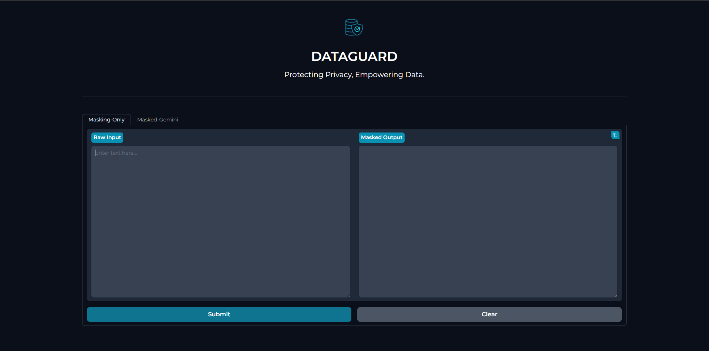

#  DataGuard — Intelligent De-Identification & Privacy Protection
A modular system for automatic detection and anonymization of **Personally Identifiable Information (PII)** and **Protected Health Information (PHI)**.

---
## Screenshot

---
## Project Summary
**DataGuard** automatically detects and anonymizes **sensitive information** (names, emails, phone numbers, dates, monetary values, medical terms, etc.) from unstructured text while preserving meaning for downstream tasks.\
It combines **rule-based methods** (regex, phone number parsing) with **NLP** (NER via spaCy/Transformers) and a domain-specific medical NER extension.\
A Gradio UI provides an interactive frontend, and the "Masked-Gemini" integration demonstrates secure downstream processing on anonymized content.

---
## Key Features
- Automated detection of **PII** & **PHI**
- **Medical NER** for detecting PHI entities (diseases, medications, procedures).
- **Masking** of detected PII and PHI
- Gradio web UI for real-time review
- Downstream processing on masked data

---
## Tech Stack
- **Languages:** Python (3.8+)
- **NLP:** spaCy, scispacy
- **Utilities:** phonenumbers, regex, google genai
- **Frontend:** Gradio

---
## Installation & Quick Start
 ```bash
git clone https://github.com/sanketh-1850/DataGuard.git
cd DataGuard
python3 -m venv venv
source venv/bin/activate  # macOS/Linux
pip install -r requirements.txt
python main.py
 ```
 ---
 ## Future Work
 - Multilingual Support
 - Extend to various other fields other than medical